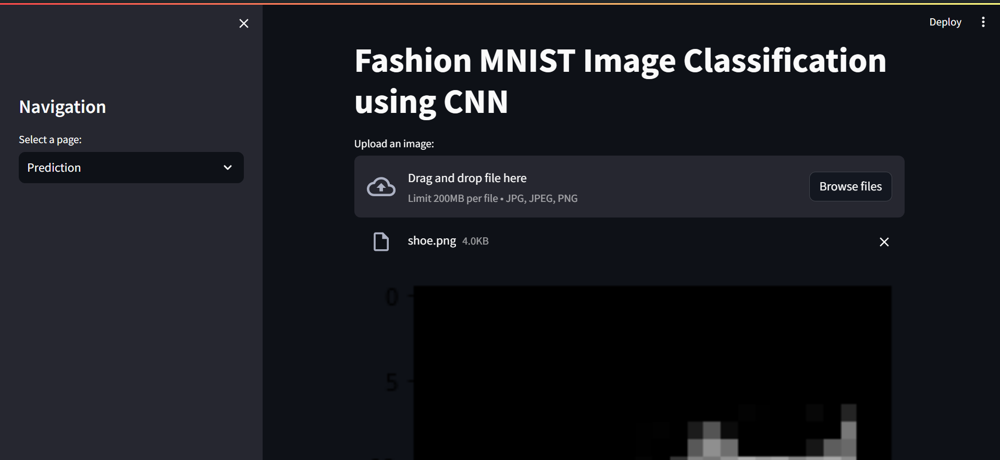
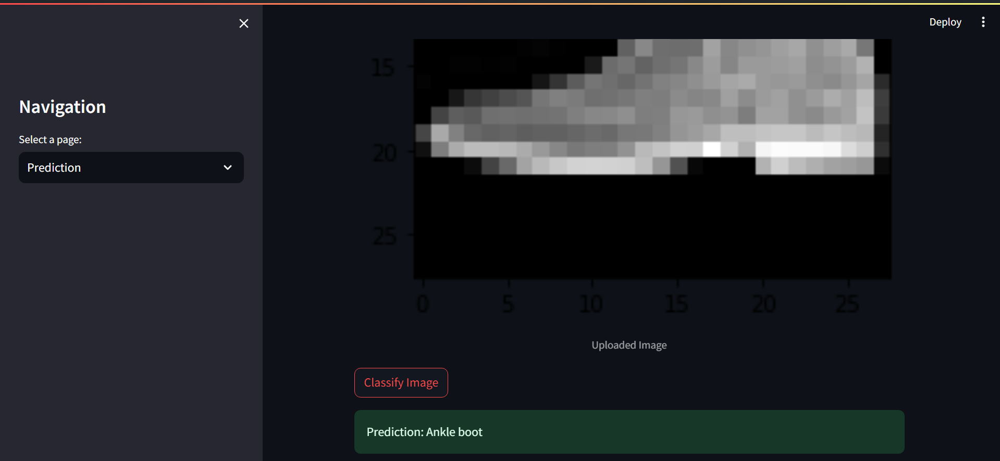
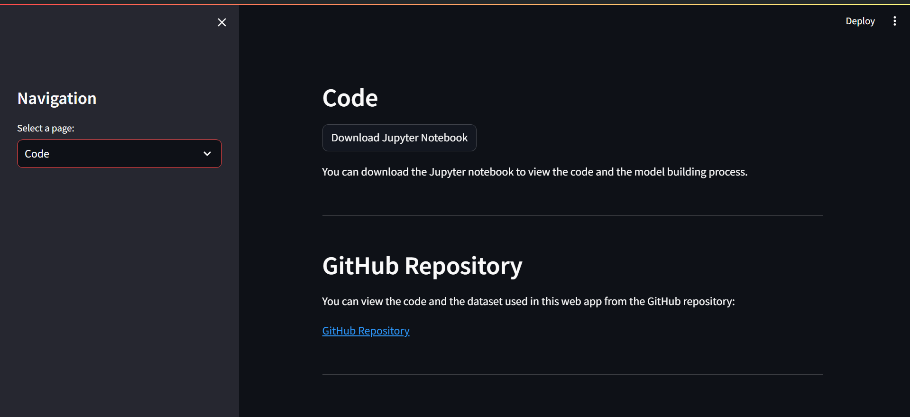
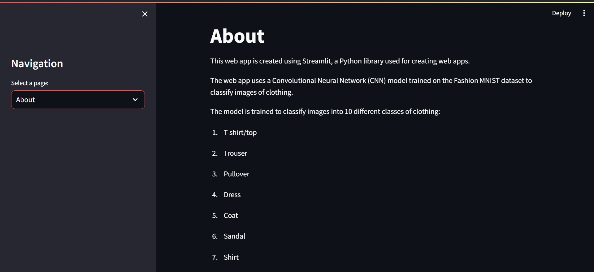

# Fashion MNIST Image Classification using CNN

This web app is created using Streamlit, a Python library used for creating web apps.
The web app uses a Convolutional Neural Network (CNN) model trained on the Fashion MNIST dataset to classify images of clothing.
The model is trained to classify images into 10 different classes of clothing:
1. T-shirt/top
2. Trouser
3. Pullover
4. Dress
5. Coat
6. Sandal
7. Shirt
8. Sneaker
9. Bag
10. Ankle boot

